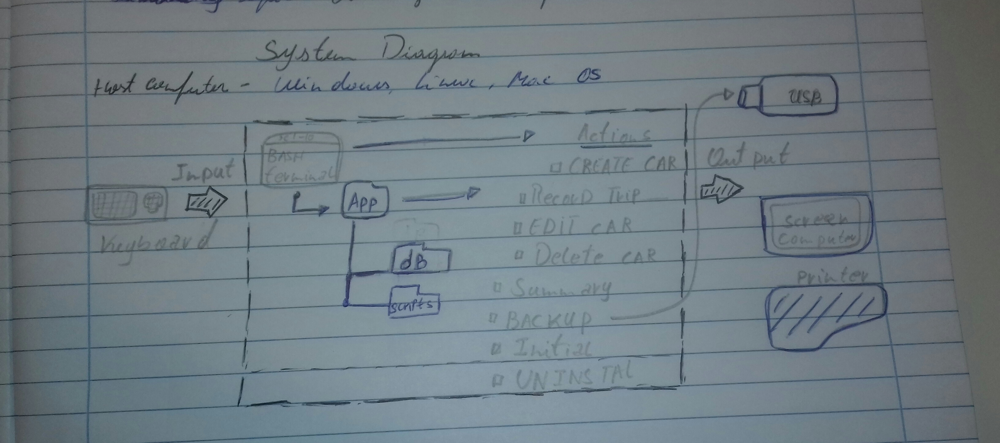
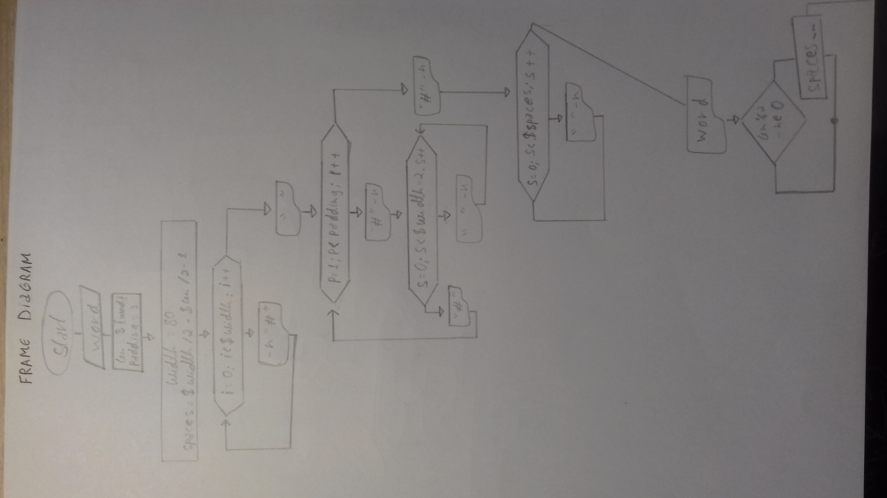
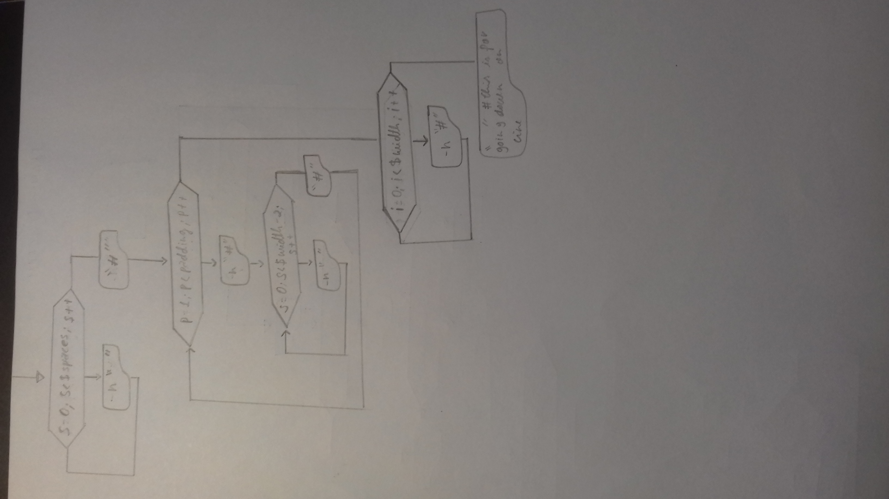

Car Rental Minimal App
===========================

A car rental management minimal app in Bash.

Contents
-----
  1. [Planning](#planning)
  1. [Design](#design)
  1. [Development](#development)
  1. [Evalution](#evaluation)

Planning
----------
### Definition of the problem 
The company wants to create a new system that should provide them information about the car, how many kms the cars run, record, summary and history of their cars. This system should be better than the last one or a new one that come to improve the company and make the process easier for their workers. However, there are many factors that influence the system or the decision to use it.
	
Sometimes new systems can fail, if this happens the company can be damaged or loose data which will cost money and time. On the other hand, the new system can also be a source of income. For instance, if it’s used efficiently, they can increase the value of their cars. When we decide to use a new system, we should consider all the outcomes for upmost efficiency. 

### definition of the problem 
A RENTALCAR company need a program to record the trips, give summary of the car, in other words, a program that a user can use and create, edit and delete cars or keep informatiom of the cars that belong to their company.

### proposed solution
we propose a new program in bash, inside terminal, a easy program to handle and it is in all computers , inside this program we can create new cars,record trips, give the summary and information about the car, the user should be able to handle the program we provide information to user achieve this and solve all issues that he face without this program.


### success criteria 
these outcomes that can be measured 
1. A car can be created 
1. A trip can be recored for a given car 
1. A summary ( total distance travel, averege)
1. A car information can be edited 
1. A basic working backup system is available 
1. the user can easily ( name notation, documentation)
1. Installation is **simple**, it does not require additional software, one step process 
1. A car information can be deleted 
1. the application can be uninstalled 

Design
--------
### First sketch of system 

### Flow diagram 


Development
--------
###1. Script for installation 
```.sh
#!/bin/bash

#This program create the folder structure for the minimal rental app

echo "Starting installation"
echo "installing in the desktop (default). Press enter"

cd ~/Desktop

#create a folder
mkdir RentalCarApp

cd RentalCarApp
mkdir database
mkdir sripts
echo "installation complete successfully"

```
This script meets the requirement of the client for a simple installation however, it could be simplified so that the user does not need to execute the program by typing ``bash install.sh`` 

### developing the action create new car 
This process involves the inputs _,_,_,_, and the outputs: 
the following steps describe the algorithm 
1 Get the inpusts as the argument '$1 $2 $3 $4'
2 check number of arguments. In bash this case can be done as 'if [ $# -eq 4 ]'
3 store new car inside maincarFile.txt 
4 create file for recording trips as plate.txt

### developing records of the news cars 
this program involves the inputs _,_,_,_, and the outputs:
the following steps describe the algorithm 
1 get the arguments $1 $2 and chec them 
2 check if the car exist, if the file exist in the bash 
3 add a new line to the file license.txt 

### developing dekete of the new cars 
this program involve inputs _,_,_,_,
the following steps describe the algorithm 
1-- get input ( #licence )
2-- flow diagram : if [ $# -ne 1], then rm -rf
2.1-- check if the car exist 
2.2-- if the car doesn’t exist then show a message to user to put the right arg or lic
3-- delete a new car inside maincarfile 

4--END 


### problem solving 
1 how to detect is a word's lenght is ood or even 
     if [ $len%2 -eg 0 ]
     
2 how to create a unstall program 
  rm -r App 
  
    
  
  

### Developping user help files 

- link to man webpage https://www.cyberciti.biz/faq/linux-unix-creating-a-manpage/ this give more information about man protocal 
- we are using man page protoical to provide help to the users, a manuel of all the commands that we can use in the terminal, this show to user the commands which includes NAME, SYNOPSIS, DESCRIPTIONS, OPTIONS, EXIT STATUS, ERRORS, FILES, EXAMPLES, AUTHORS.( adapted from GeeksforGeeks.com)

Evaluation
-----------
Test 1: a car can be created and stored in the dabase 
For this purpose we will create the file testCreate.sh. this is called software testing 

the first step is to check for this file 
```.sh 
cd ../scripts/ 
if [ -f "create.sh" ]; then 
          echo "file exist, test will start now"
else 
          echo "file create.sh does not exist, test failed 
fi 
```
here the option -f in the if condition checks for a file in the wor

this corresponds to Dynamic testing instead of static, alpha testing, white-box and automated testing 
